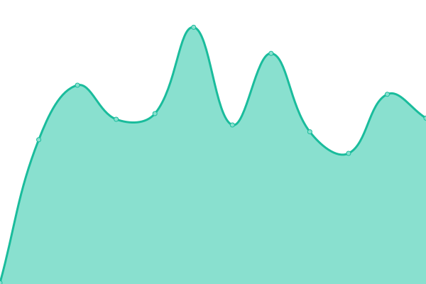

# [📈 Live Status](https://advancedcsg-open.github.io/toolchain-status-dashboard): <!--live status--> **🟩 All systems operational**

This repository contains the open-source uptime monitor and status page for [Advanced (open source)](https://oneadvanced.com), powered by [Upptime](https://github.com/upptime/upptime).

With [Upptime](https://upptime.js.org), you can get your own unlimited and free uptime monitor and status page, powered entirely by a GitHub repository. We use [Issues](https://github.com/advancedcsg-open/toolchain-status-dashboard/issues) as incident reports, [Actions](https://github.com/advancedcsg-open/toolchain-status-dashboard/actions) as uptime monitors, and [Pages](https://advancedcsg-open.github.io/toolchain-status-dashboard) for the status page.

<!--start: status pages-->
<!-- This summary is generated by Upptime (https://github.com/upptime/upptime) -->
<!-- Do not edit this manually, your changes will be overwritten -->
<!-- prettier-ignore -->
| URL | Status | History | Response Time | Uptime |
| --- | ------ | ------- | ------------- | ------ |
|  [Advanced Site without token](https://advancedcsg.atlassian.net/plugins/servlet/ac/advanced-metrics/advanced-metrics-home) | 🟩 Up | [advanced-site-without-token.yml](https://github.com/advancedcsg-open/toolchain-status-dashboard/commits/HEAD/history/advanced-site-without-token.yml) | 

 902ms
     
 | 

<a href="https://advancedcsg-open.github.io/toolchain-status-dashboard/history/advanced-site-without-token">100.00%</a>
    

|  [Sonarqube](https://ccq.svc.oneadvanced.com/api/system/status) | 🟩 Up | [sonarqube.yml](https://github.com/advancedcsg-open/toolchain-status-dashboard/commits/HEAD/history/sonarqube.yml) | 

 511ms
     
 | 

<a href="https://advancedcsg-open.github.io/toolchain-status-dashboard/history/sonarqube">100.00%</a>
    

|  [Unleash](https://unleash.svc.oneadvanced.com/) | 🟩 Up | [unleash.yml](https://github.com/advancedcsg-open/toolchain-status-dashboard/commits/HEAD/history/unleash.yml) | 

 490ms
     
 | 

<a href="https://advancedcsg-open.github.io/toolchain-status-dashboard/history/unleash">100.00%</a>
    

|  [GitHub](https://api.github.com/orgs/advancedcsg) | 🟩 Up | [git-hub.yml](https://github.com/advancedcsg-open/toolchain-status-dashboard/commits/HEAD/history/git-hub.yml) | 

 153ms
     
 | 

<a href="https://advancedcsg-open.github.io/toolchain-status-dashboard/history/git-hub">94.70%</a>
    

|  [CMISGO](https://api.github.com/orgs/advancedcsg/actions/runners/44) | 🟩 Up | [cmisgo.yml](https://github.com/advancedcsg-open/toolchain-status-dashboard/commits/HEAD/history/cmisgo.yml) | 

 164ms
     
 | 

<a href="https://advancedcsg-open.github.io/toolchain-status-dashboard/history/cmisgo">100.00%</a>
    

|  [WIN-8I19VLCBLTQ](https://api.github.com/orgs/advancedcsg/actions/runners/37) | 🟩 Up | [win-8-i19-vlcbltq.yml](https://github.com/advancedcsg-open/toolchain-status-dashboard/commits/HEAD/history/win-8-i19-vlcbltq.yml) | 

 171ms
     
 | 

<a href="https://advancedcsg-open.github.io/toolchain-status-dashboard/history/win-8-i19-vlcbltq">100.00%</a>
    

|  [ALB-GithubRunner](https://api.github.com/orgs/advancedcsg/actions/runners/57) | 🟩 Up | [alb-github-runner.yml](https://github.com/advancedcsg-open/toolchain-status-dashboard/commits/HEAD/history/alb-github-runner.yml) | 

 199ms
     
 | 

<a href="https://advancedcsg-open.github.io/toolchain-status-dashboard/history/alb-github-runner">100.00%</a>
    

|  [adv-compass-pmdevel](https://api.github.com/orgs/advancedcsg/actions/runners/310) | 🟩 Up | [adv-compass-pmdevel.yml](https://github.com/advancedcsg-open/toolchain-status-dashboard/commits/HEAD/history/adv-compass-pmdevel.yml) | 

 172ms
     
 | 

<a href="https://advancedcsg-open.github.io/toolchain-status-dashboard/history/adv-compass-pmdevel">100.00%</a>
    

|  [adv-cypress-runner-32442](https://api.github.com/orgs/advancedcsg/actions/runners/853) | 🟩 Up | [adv-cypress-runner-32442.yml](https://github.com/advancedcsg-open/toolchain-status-dashboard/commits/HEAD/history/adv-cypress-runner-32442.yml) | 

 164ms
     
 | 

<a href="https://advancedcsg-open.github.io/toolchain-status-dashboard/history/adv-cypress-runner-32442">100.00%</a>
    

|  [advancedcsg-self-hosted-runner-zrvln-qjlf8](https://api.github.com/orgs/advancedcsg/actions/runners/1592) | 🟩 Up | [advancedcsg-self-hosted-runner-zrvln-qjlf8.yml](https://github.com/advancedcsg-open/toolchain-status-dashboard/commits/HEAD/history/advancedcsg-self-hosted-runner-zrvln-qjlf8.yml) | 

 148ms
     
 | 

<a href="https://advancedcsg-open.github.io/toolchain-status-dashboard/history/advancedcsg-self-hosted-runner-zrvln-qjlf8">100.00%</a>
    

|  [adv-cypress-runner-13963](https://api.github.com/orgs/advancedcsg/actions/runners/1136) | 🟩 Up | [adv-cypress-runner-13963.yml](https://github.com/advancedcsg-open/toolchain-status-dashboard/commits/HEAD/history/adv-cypress-runner-13963.yml) | 

 177ms
     
 | 

<a href="https://advancedcsg-open.github.io/toolchain-status-dashboard/history/adv-cypress-runner-13963">100.00%</a>
    

|  [adv-cypress-runner-20878](https://api.github.com/orgs/advancedcsg/actions/runners/1138) | 🟩 Up | [adv-cypress-runner-20878.yml](https://github.com/advancedcsg-open/toolchain-status-dashboard/commits/HEAD/history/adv-cypress-runner-20878.yml) | 

 165ms
     
 | 

<a href="https://advancedcsg-open.github.io/toolchain-status-dashboard/history/adv-cypress-runner-20878">100.00%</a>
    

|  [adv-cypress-runner-26878](https://api.github.com/orgs/advancedcsg/actions/runners/1135) | 🟩 Up | [adv-cypress-runner-26878.yml](https://github.com/advancedcsg-open/toolchain-status-dashboard/commits/HEAD/history/adv-cypress-runner-26878.yml) | 

 165ms
     
 | 

<a href="https://advancedcsg-open.github.io/toolchain-status-dashboard/history/adv-cypress-runner-26878">0.00%</a>
    

<!--end: status pages-->

[**Visit our status website →**](https://advancedcsg-open.github.io/toolchain-status-dashboard)

## 📄 License

- Powered by: [Upptime](https://github.com/upptime/upptime)
- Code: [MIT](./LICENSE) © [Advanced (open source)](https://oneadvanced.com)
- Data in the `./history` directory: [Open Database License](https://opendatacommons.org/licenses/odbl/1-0/)
