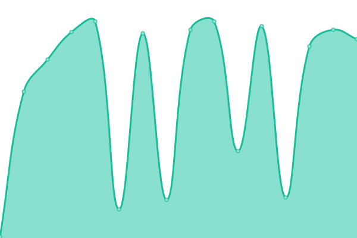
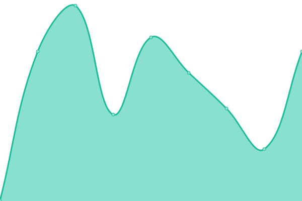
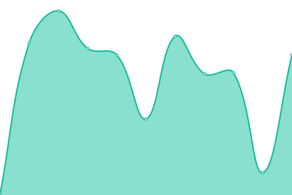

# [📈 Live Status](https://advancedcsg-open.github.io/toolchain-status-dashboard): <!--live status--> **🟧 Partial outage**

This repository contains the open-source uptime monitor and status page for [Advanced (open source)](https://oneadvanced.com), powered by [Upptime](https://github.com/upptime/upptime).

With [Upptime](https://upptime.js.org), you can get your own unlimited and free uptime monitor and status page, powered entirely by a GitHub repository. We use [Issues](https://github.com/advancedcsg-open/toolchain-status-dashboard/issues) as incident reports, [Actions](https://github.com/advancedcsg-open/toolchain-status-dashboard/actions) as uptime monitors, and [Pages](https://advancedcsg-open.github.io/toolchain-status-dashboard) for the status page.

<!--start: status pages-->
<!-- This summary is generated by Upptime (https://github.com/upptime/upptime) -->
<!-- Do not edit this manually, your changes will be overwritten -->
<!-- prettier-ignore -->
| URL | Status | History | Response Time | Uptime |
| --- | ------ | ------- | ------------- | ------ |
|  [Sonarqube](https://ccq.svc.oneadvanced.com/api/system/status) | 🟩 Up | [sonarqube.yml](https://github.com/advancedcsg-open/toolchain-status-dashboard/commits/HEAD/history/sonarqube.yml) | 

 551ms
     
 | 

<a href="https://advancedcsg-open.github.io/toolchain-status-dashboard/history/sonarqube">100.00%</a>
    

|  [Unleash](https://unleash.svc.oneadvanced.com/) | 🟩 Up | [unleash.yml](https://github.com/advancedcsg-open/toolchain-status-dashboard/commits/HEAD/history/unleash.yml) | 

 474ms
     
 | 

<a href="https://advancedcsg-open.github.io/toolchain-status-dashboard/history/unleash">100.00%</a>
    

|  [Advancedcsg Github Org](https://api.github.com/orgs/advancedcsg) | 🟩 Up | [advancedcsg-github-org.yml](https://github.com/advancedcsg-open/toolchain-status-dashboard/commits/HEAD/history/advancedcsg-github-org.yml) | 

 123ms
     
 | 

<a href="https://advancedcsg-open.github.io/toolchain-status-dashboard/history/advancedcsg-github-org">100.00%</a>
    

|  [Fossa](https://status.fossa.com/) | 🟩 Up | [fossa.yml](https://github.com/advancedcsg-open/toolchain-status-dashboard/commits/HEAD/history/fossa.yml) | 

 438ms
     
 | 

<a href="https://advancedcsg-open.github.io/toolchain-status-dashboard/history/fossa">98.40%</a>
    

|  [Harness](https://status.harness.io/) | 🟥 Down | [harness.yml](https://github.com/advancedcsg-open/toolchain-status-dashboard/commits/HEAD/history/harness.yml) | 

 459ms
     
 | 

<a href="https://advancedcsg-open.github.io/toolchain-status-dashboard/history/harness">99.68%</a>
    

|  [JIRA](https://jira-service-management.status.atlassian.com/) | 🟩 Up | [jira.yml](https://github.com/advancedcsg-open/toolchain-status-dashboard/commits/HEAD/history/jira.yml) | 

 331ms
     
 | 

<a href="https://advancedcsg-open.github.io/toolchain-status-dashboard/history/jira">100.00%</a>
    

|  [OpsGenie](https://opsgenie.status.atlassian.com/) | 🟩 Up | [ops-genie.yml](https://github.com/advancedcsg-open/toolchain-status-dashboard/commits/HEAD/history/ops-genie.yml) | 

 457ms
     
 | 

<a href="https://advancedcsg-open.github.io/toolchain-status-dashboard/history/ops-genie">100.00%</a>
    

|  [GitHub](https://www.githubstatus.com/) | 🟩 Up | [git-hub.yml](https://github.com/advancedcsg-open/toolchain-status-dashboard/commits/HEAD/history/git-hub.yml) | 

 325ms
     
 | 

<a href="https://advancedcsg-open.github.io/toolchain-status-dashboard/history/git-hub">99.67%</a>
    

|  [Toolchain keycloak](https://keycloak.identity.oneadvanced.com/auth/admin/jenkins/console/) | 🟩 Up | [toolchain-keycloak.yml](https://github.com/advancedcsg-open/toolchain-status-dashboard/commits/HEAD/history/toolchain-keycloak.yml) | 

 532ms
     
 | 

<a href="https://advancedcsg-open.github.io/toolchain-status-dashboard/history/toolchain-keycloak">100.00%</a>
    

|  [CMISGO](https://api.github.com/orgs/advancedcsg/actions/runners/44) | 🟥 Down | [cmisgo.yml](https://github.com/advancedcsg-open/toolchain-status-dashboard/commits/HEAD/history/cmisgo.yml) | 

 264ms
     
 | 

<a href="https://advancedcsg-open.github.io/toolchain-status-dashboard/history/cmisgo">34.98%</a>
    

|  [WIN-8I19VLCBLTQ](https://api.github.com/orgs/advancedcsg/actions/runners/37) | 🟩 Up | [win-8-i19-vlcbltq.yml](https://github.com/advancedcsg-open/toolchain-status-dashboard/commits/HEAD/history/win-8-i19-vlcbltq.yml) | 

 187ms
     
 | 

<a href="https://advancedcsg-open.github.io/toolchain-status-dashboard/history/win-8-i19-vlcbltq">100.00%</a>
    

|  [ALB-GithubRunner](https://api.github.com/orgs/advancedcsg/actions/runners/57) | 🟩 Up | [alb-github-runner.yml](https://github.com/advancedcsg-open/toolchain-status-dashboard/commits/HEAD/history/alb-github-runner.yml) | 

 169ms
     
 | 

<a href="https://advancedcsg-open.github.io/toolchain-status-dashboard/history/alb-github-runner">100.00%</a>
    

|  [adv-compass-pmdevel](https://api.github.com/orgs/advancedcsg/actions/runners/310) | 🟥 Down | [adv-compass-pmdevel.yml](https://github.com/advancedcsg-open/toolchain-status-dashboard/commits/HEAD/history/adv-compass-pmdevel.yml) | 

 193ms
     
 | 

<a href="https://advancedcsg-open.github.io/toolchain-status-dashboard/history/adv-compass-pmdevel">43.93%</a>
    

|  [adv-cypress-runner-1968](https://api.github.com/orgs/advancedcsg/actions/runners/1812) | 🟩 Up | [adv-cypress-runner-1968.yml](https://github.com/advancedcsg-open/toolchain-status-dashboard/commits/HEAD/history/adv-cypress-runner-1968.yml) | 

 174ms
     
 | 

<a href="https://advancedcsg-open.github.io/toolchain-status-dashboard/history/adv-cypress-runner-1968">100.00%</a>
    

|  [adv-cypress-runner-22229](https://api.github.com/orgs/advancedcsg/actions/runners/1782) | 🟩 Up | [adv-cypress-runner-22229.yml](https://github.com/advancedcsg-open/toolchain-status-dashboard/commits/HEAD/history/adv-cypress-runner-22229.yml) | 

 202ms
     
 | 

<a href="https://advancedcsg-open.github.io/toolchain-status-dashboard/history/adv-cypress-runner-22229">100.00%</a>
    

|  [adv-cypress-runner-9634](https://api.github.com/orgs/advancedcsg/actions/runners/1824) | 🟩 Up | [adv-cypress-runner-9634.yml](https://github.com/advancedcsg-open/toolchain-status-dashboard/commits/HEAD/history/adv-cypress-runner-9634.yml) | 

 177ms
     
 | 

<a href="https://advancedcsg-open.github.io/toolchain-status-dashboard/history/adv-cypress-runner-9634">100.00%</a>
    

|  [adv-cypress-runner-9583](https://api.github.com/orgs/advancedcsg/actions/runners/1823) | 🟩 Up | [adv-cypress-runner-9583.yml](https://github.com/advancedcsg-open/toolchain-status-dashboard/commits/HEAD/history/adv-cypress-runner-9583.yml) | 

 168ms
     
 | 

<a href="https://advancedcsg-open.github.io/toolchain-status-dashboard/history/adv-cypress-runner-9583">100.00%</a>
    

<!--end: status pages-->

[**Visit our status website →**](https://advancedcsg-open.github.io/toolchain-status-dashboard)

## 📄 License

- Powered by: [Upptime](https://github.com/upptime/upptime)
- Code: [MIT](./LICENSE) © [Advanced (open source)](https://oneadvanced.com)
- Data in the `./history` directory: [Open Database License](https://opendatacommons.org/licenses/odbl/1-0/)
